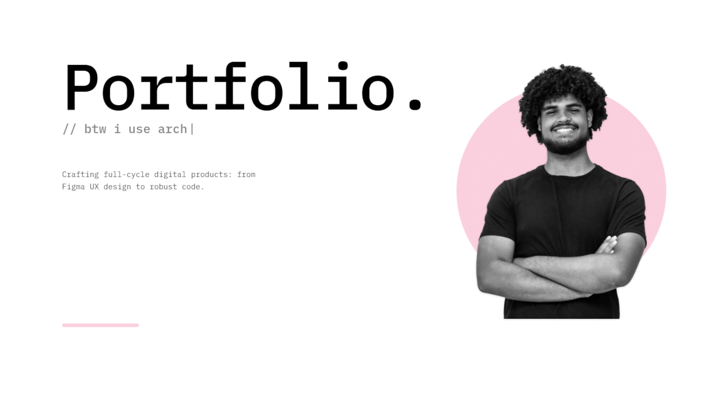

# Edgar Henrique | Portfolio



Personal portfolio designed to showcase my work in software development, UI/UX design, and end-to-end digital solutions.

Live: https://edgardev.codes

The project was conceptualized and prototyped in Figma, focusing on clean visual hierarchy, a monospaced aesthetic, and high fidelity across both mobile and desktop devices.

## Tech Stack

- React 19
- TypeScript
- Vite
- Tailwind CSS v4
- Framer Motion
- Oxlint
- IBM Plex Mono

## Key Features

- Native internationalization supporting English (EN_US) and Portuguese (PT_BR).
- Smooth navigation with a responsive project carousel and category filters.
- Scroll-triggered animated proficiency gauges.
- Accessible mobile drawer menu with keyboard (Escape) and click-outside dismissal.
- Global smooth scrolling with reduced-motion accessibility support.

## Getting Started

### Prerequisites

- Node.js (v20+ recommended)
- npm or your preferred package manager

### Installation and Setup

1. Clone the repository:
   ```bash
   git clone https://github.com/Edgar-sh/portfolio.git
   cd portfolio
   ```

2. Install dependencies:
   ```bash
   npm install
   ```

3. Start the local development server:
   ```bash
   npm run dev
   ```

4. To test on mobile devices across your local network:
   ```bash
   npm run dev -- --host
   ```

### Available Scripts

- `npm run dev`: Starts the local Vite development server.
- `npm run build`: Type-checks with TypeScript and creates an optimized production build.
- `npm run lint`: Runs static code analysis with Oxlint.
- `npm run preview`: Previews the production build locally.

## Contact

- Website: https://edgardev.codes
- GitHub: https://github.com/Edgar-sh
- LinkedIn: https://www.linkedin.com/in/edgar-henrique-b34962320/
- Instagram: https://www.instagram.com/henriqueapenas_/
- Email: Edgar.silva@dcx.ufpb.br
